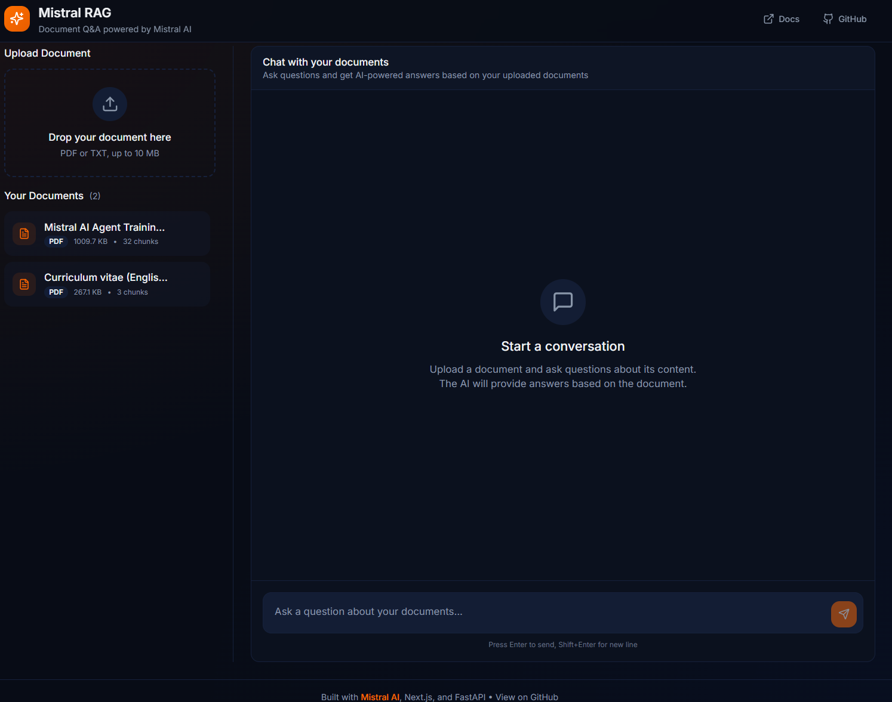

# Mistral RAG - Document Question-Answering

A modern document Q&A application powered by **Mistral AI**, built with **FastAPI** and **Next.js**. Upload your documents and ask questions in natural language to get AI-powered answers with source citations.


## Application Overview



## Features

- **Document Upload**: Drag-and-drop PDF and TXT files
- **RAG Pipeline**: Automatic chunking, embedding, and retrieval
- **Conversational AI**: Ask questions in natural language
- **Source Citations**: See which document excerpts were used for each answer
- **Streaming Responses**: Real-time answer generation with SSE
- **Modern UI**: Clean, professional interface with dark theme


### RAG Workflow

1. **Ingestion**: Documents are uploaded, text is extracted, split into chunks, and embedded using `mistral-embed`
2. **Retrieval**: User questions are embedded and matched against document chunks using similarity search
3. **Generation**: Relevant context is sent to `mistral-small-latest` to generate accurate, sourced answers

## Quick Start

### Prerequisites

- Python 3.11+
- Node.js 18+
- Mistral AI API key ([Get one here](https://console.mistral.ai/))

### Option 1: Local Development

#### 1. Clone and setup

```bash
git clone <repository-url>
cd mistralAI-project-role-application
```

#### 2. Configure environment

```bash
cp .env.example .env
cp backend/env.example backend/.env
cp frontend/env.example frontend/.env.local
# Edit .env files and add your MISTRAL_API_KEY
```

#### 3. Start the backend

```bash
cd backend
python -m venv venv
source venv/bin/activate  # On Windows: venv\Scripts\activate
pip install -r requirements.txt
uvicorn app.main:app --reload
```

The API will be available at `http://localhost:8001`

#### 4. Start the frontend

```bash
cd frontend
npm install
npm run dev
```

The app will be available at `http://localhost:3000`

### Option 2: Docker Compose

```bash
# Configure environment
cp env.example .env
# Edit .env and add your MISTRAL_API_KEY

# Start all services
docker-compose up --build
```

Access the app at `http://localhost:3000`

## API Endpoints

### Documents

| Method | Endpoint | Description |
|--------|----------|-------------|
| `POST` | `/api/documents/upload` | Upload a document (PDF/TXT) |
| `GET` | `/api/documents` | List all documents |
| `GET` | `/api/documents/{id}` | Get document info |
| `DELETE` | `/api/documents/{id}` | Delete a document |

### Chat

| Method | Endpoint | Description |
|--------|----------|-------------|
| `POST` | `/api/chat` | Send a question (non-streaming) |
| `POST` | `/api/chat/stream` | Send a question (SSE streaming) |

## Project Structure

```
mistralAI-project-role-application/
├── backend/
│   ├── app/
│   │   ├── api/              # API routes
│   │   │   ├── chat.py       # Chat endpoints
│   │   │   └── documents.py  # Document endpoints
│   │   ├── core/             # Configuration
│   │   │   ├── config.py     # Settings management
│   │   │   └── dependencies.py
│   │   ├── models/           # Pydantic schemas
│   │   │   └── schemas.py
│   │   ├── services/         # Business logic
│   │   │   ├── ingestion.py  # Document processing
│   │   │   ├── retrieval.py  # Vector search
│   │   │   └── generation.py # LLM interaction
│   │   └── main.py           # FastAPI app
│   ├── tests/                # Pytest tests
│   ├── requirements.txt
│   └── Dockerfile
├── frontend/
│   ├── src/
│   │   ├── app/              # Next.js pages
│   │   ├── components/       # React components
│   │   │   ├── chat/         # Chat UI
│   │   │   ├── documents/    # Document management
│   │   │   └── ui/           # shadcn/ui components
│   │   ├── lib/              # API client, utilities
│   │   └── types/            # TypeScript types
│   ├── package.json
│   └── Dockerfile
├── docker-compose.yml
├── .env.example
└── README.md
```

## Configuration

| Variable | Description | Default |
|----------|-------------|---------|
| `MISTRAL_API_KEY` | Your Mistral AI API key | Required |
| `MISTRAL_EMBED_MODEL` | Embedding model | `mistral-embed` |
| `MISTRAL_CHAT_MODEL` | Chat model | `mistral-small-latest` |
| `CHUNK_SIZE` | Target tokens per chunk | `500` |
| `CHUNK_OVERLAP` | Overlap between chunks | `50` |
| `RETRIEVAL_TOP_K` | Number of chunks to retrieve | `5` |
| `NEXT_PUBLIC_API_URL` | Backend URL for frontend | `http://localhost:8001` |

## Testing

### Backend Tests

```bash
cd backend
pytest -v
```

### Test Coverage

```bash
pytest --cov=app --cov-report=html
```

## Tech Stack

### Backend
- **FastAPI** - Modern Python web framework
- **Mistral AI SDK** - LLM and embeddings
- **ChromaDB** - Vector database
- **pypdf** - PDF text extraction
- **Pydantic** - Data validation

### Frontend
- **Next.js 14** - React framework with App Router
- **TypeScript** - Type safety
- **Tailwind CSS** - Styling
- **shadcn/ui** - UI components
- **Lucide** - Icons

## Design Decisions

1. **ChromaDB over alternatives**: Chosen for simplicity and zero-config local storage
2. **Streaming responses**: Better UX with real-time feedback using Server-Sent Events
3. **Source citations**: Transparency in AI responses by showing relevant document excerpts
4. **Modular services**: Clear separation between ingestion, retrieval, and generation for testability

## Limitations

- Maximum file size: 10 MB
- Supported formats: PDF, TXT
- Single-user mode (no authentication)
- In-memory/local vector storage (not suitable for production at scale)

## Improvements

- [ ] Multi-user support with authentication
- [ ] More document formats (DOCX, Markdown)
- [ ] Conversation persistence
- [ ] Advanced chunking strategies
- [ ] Hybrid search (keyword + semantic)
- [ ] Production-ready vector database (Qdrant, Pinecone)

## License

MIT

---

Built with ❤️ for **Mistral AI** internship application
